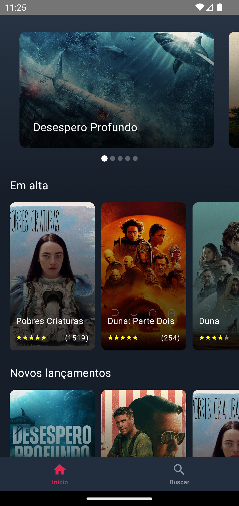
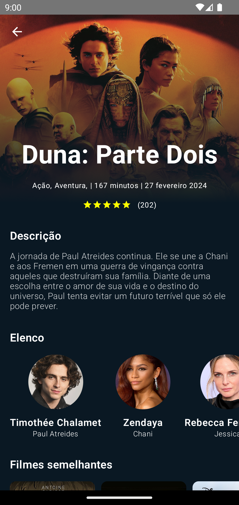
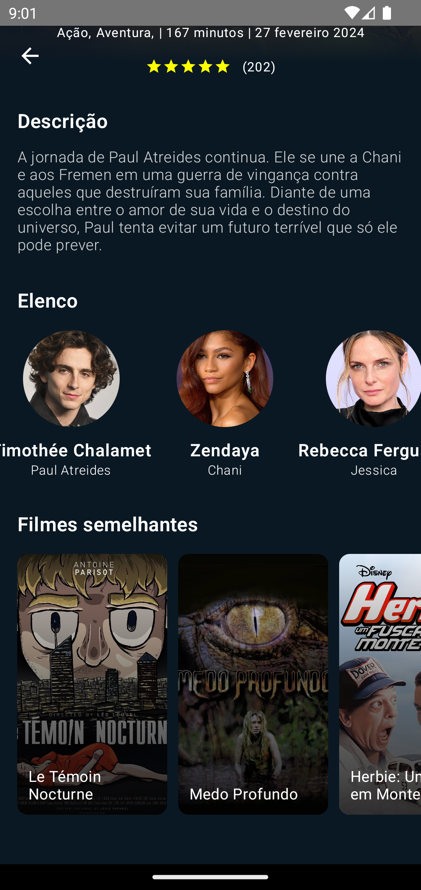
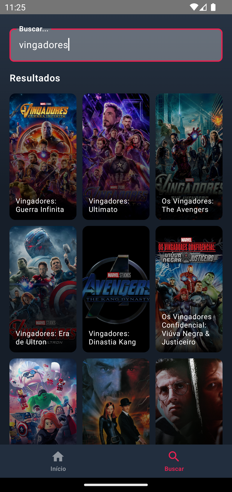

<h1 align="center">
 
Movie App KMP
</h1>

# 📋 Índice

- [Telas](#-Telas)
- [Sobre o projeto](#-Sobre-o-projeto)
- [Tecnologias utilizadas](#-Tecnologias-utilizadas)
- [Rodando o app](#-Rodando-o-app)

## 🎨 Telas

## 📃 Sobre o projeto

App desenvolvido com intuito de aprender mais sobre Compose Multiplatform, utilizando algumas das principais ferramentas utilizadas pela comunidade, junto com o framework. Parte do layout foi baseada no protótipo desse <a href="https://www.figma.com/community/file/1119545637831909826/ticket-booking-app">link</a>, desenvolvido pela Nickelfox Design. Os dados do app são provenientes da API pública do TMDB.

## 🛠 Tecnologias utilizadas

- 📱 **Compose multiplatform** — Aplicativo mobile para Android e iOS.
- 🛸 **Voyager** — Navegação entre telas e estrutura base para ViewModels.
- 🪙 **Koin** — Injeção de dependências.
- 💻 **Ktor** — Requisições para a API.
- 🔐️ **Kotlinx serialization** — Desserialização de dados vindos da API.
- 🕛 **Coroutines** — Chamadas assíncronas.
- 📝 **Napier** — Logs da aplicação.
- 🖼️ **Kamel** — Renderização de imagens vindas da API.
- 🗓️️ **Kotlinx** datetime — Formatação de datas.

## 🚀 Rodando o app

### Pré-requisitos

- Android Studio
- Macos (Para rodar a versão de iOS)
- Cadastro no TMDB para geração de uma API key

### Passo-a-passo

<ol>
  <li>Abra a pasta raiz do projeto no Android Studio.</li>
  <li>Localize o arquivo `local.properties`.</li>
  <li>Adicione a seguinte linha:
  API_KEY=sua_api_key_gerada_no_tmdb.
  </li>
  <li>Selecione a opção `composeApp` na barra superior do Android Studio e aperte o botão play.</li>
  <li>Caso deseje rodar a versão de iOS, selecione a opção `iosApp` na barra superior do Android Studio e aperte o botão play.</li>
</ol>
